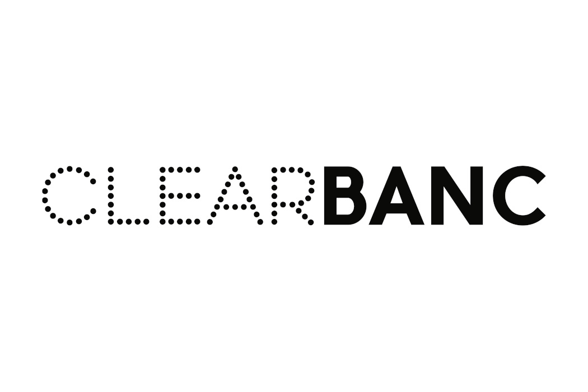

### Preface:   

"Debt is Bad" - this is a common mantra that pervades Silicon Valley, espoused by upstarts and veterans alike. Certainly debt does not make sense for an early stage software business. For these early stage companies, finding product-market fit is paramount and the high risk nature of these start-ups simply does not play nicely with debt financing.

Indeed this leads us to the fact that **because so many startups fail, equity investing is necessary.** However, against this supposed gospel, we take the contrarian view and believe as Alex Danco from Social Capital puts it **"so many startups fail because of equity investing."**

>> so many startups fail because of equity investing. - Alex Danco, Social Capital

Why? Well for a more mature company that does have product-market fit and solvent unit economics, growth is the first priority. But the risk profile of growth operations looks drastically different than that of initial product development. It is far less risky and the payout is relatively more capped. For example, hiring a salesperson is less risky than trying to build out a new product; it will also have more limited returns.

Because of this limited upside, founders are reluctant to dilute their equity further to raise money for growth operations. This causes them to underinvest in distribution and growth and as Peter Thiel says **"Poor distribution — not product — is the number one cause of failure."**

>> Poor distribution — not product — is the number one cause of failure. - Peter Thiel

What's more is that tech companies with established channels of recurring revenue do have the predictable cash flows needed to service debt. Take SaaS businesses for example, the monthly payments that SaaS users make is similar in structure to the cash flows of a monthly mortgage payment. The only difference is that one is backed by an asset and the other is backed by trust that mass churn won't occur. For an established SaaS company, this trust seems fair.

For these reasons we believe that debt is the missing piece for growth stage tech companies. But as we seek to defend this theory we come face-to-face with the old dogma "Debt is bad."

Perhaps, but rather than just accepting this as is. We will do the following:

### Agenda

1. Investigate the current problems with debt for growth stage tech companies
2. Examine better debt instruments
3. Reimagine the underwriting process using SaaS based metrics
4. Identify current companies who could potentially be the vendors of these new debt instruments.   

### Problems with Debt in its Current State
1. Requires physical assets to serve as collateral. (Growth stage tech companies don't have much of this)
2. High interest rates and need of personal guarantee from owners.
3. Length of underwriting process (2-6 months). Too long for any startup
4. Requires interest to be paid even on money that is not used at that time.

### Solving 1&2: Better Debt Instruments

Lets first address problems 1 & 2 by thinking about debt instruments with a fundamentally different structure than current loans which are slow and asset demanding.

There are several products that could appeal to businesses.

  

1. **Merchant Cash Advance:** ClearBanc uses this right now, albeit with little flexibility in their product. Companies can ask for a cash advance on their future sales for a fixed percentage fee (5%), and then pay back the lender as their revenue rolls in. Meanwhile, they can use the cash advance to fuel growth now.

2. **A Fixed Income Instrument:** This is a bit more of a bet for the lender. Lenders can offer large loans in exchange for a fixed percentage of future revenues for a pre-established time period. For example, a lender (like Stripe or Square Capital) offers 1 million dollars in exchange for 3% of monthly revenues for the next 24 months. Of course, these are arbitrary numbers, but note that this is a product designed specifically for high margin SaaS companies that can afford 3%, and for Stripe/Square to offer, since it may be the one handling payments for the company in the first place! It has much more data to set the product terms than does any other lender.

3. **Cash flow securitization:** This was suggested by Alex Danco in "Debt is Coming." Businesses can sell their cash flows for debt, use the debt funding to acquire the next tier of customers, sell the cash flow for debt, ad infinitum. This is somewhat similar to #2 on this list, but the lender could securitize across many companies and then sell the financial instrument to any interested buyer. Because the instrument is now diversified (in some sense), it may be less risky overall. It also allows the lender to get the loan off its balance sheet, which may be in its interest depending on the particular details.

We can imagine that each of these options will appeal to different customers, and they can choose what is best for them. The question now becomes how to design an underwriting process that

- Reduces time of underwriting
- Allows a startup to only pay interest on the debt it immediately needs.
- Gives the lender high conviction that the startup can pay.

We now turn to some metrics that we believe will be useful for underwriting debt products.

  

### Solving 3&4: Metric Based Underwriting

A growth stage tech company may be worthy of debt if it can show strength across these three fronts

1. Retention
2. Margin
3. Growth

#### Retention

1. **Revenue Churn:** Revenue churn rather than customer churn is often more telling for later stage company health. Regular customer churn does not illustrate whether it is your so-so customers or your strongest customers that are churning. For mature startups small monthly churns compound to massive numbers. 3% monthly churn => 31% yearly churn. Recovering this in the form of acquiring new customers is very expensive. This is a vital metric that must stay low in order for a company to be debt grade.

2. **Net Churn:** Revenue lost due to churn and contraction - Revenue gained from current customers . If this number is negative it shows that the company is able to grow revenues without adding new customers. This is a very positive sign for any debt issuer.  

#### Margin

1. **Lifetime Value (LTV) >= 3 * Customer Acquisition Cost (CAC)**: This is a pretty simple rule of thumb but foundational to ensure good unit economics.

2. **Time to recover CAC:** CAC / Average MRR (monthly recurring revenue) of customer .This number is paramount to formulate the terms of the loan. If it takes 2 years to recover CAC, then creating a debt instrument whose lifetime is one year will just cause liquidity problems for the company.

#### Growth

1. **MRR:** Plain and simple. There needs to be enough future cash flows to service the debt.
2. **Expansion Revenue:** additional revenue from current customers. Upselling and cross selling your current customers is a quicker way to generate returns than going after newer customers. Thus expansion revenue is more appropriate to service debt, which lies on a shorter time frame than equity

These metrics are constantly evolving and as such capital could be deployed incrementally. As long as the KPI thresholds are met, the next round is deployed. This is mutually beneficial for two reasons:

1. It protects the lender from **overcommitting capital.** They only are obliged to invest if the metrics continuously look good
2. **It prevents SaaS companies from having to frontload on debt and having to pay interest for it throughout.** In growth stage, capital needs six months from now could look very different than today, and a company should not have to pay interest for money it intends to use only after six months.

In the last part of this exploration we ask ourselves the question "who would be the best vendors of these debt instruments?"

### Why Brex, Stripe, Square are Well Positioned
 

  

As shown above, to underwrite well, lenders will need data. We believe Brex, Stripe, and Square all have certain qualities that make them ideal candidates for providing debt in the target space. For one, all these companies have instant access to their customers' daily revenue and account balances. They already use this to supply SMB loans. We believe they can expand their offerings to help more growth stage tech companies. And why should they bother? **It is the same lesson that GE learned so many decades ago, helping to finance the growth of your customers is a great way to catalyze sales.**

1. Stripe (Vertical Integration): Stripe's ecosystem of fintech and legal products give them vertical integration for anyone trying to start and grow a digital business. A SaaS company that uses Atlas to launch, Payments for credit card processing, and Billing and Payouts to handle subscription revenue and costs would be more inclined to turn to Stripe Capital if they had a debt offering unique for SaaS companies.

2. Square (Securitization): While it is true that Square's current customer base is mostly not SaaS companies, Square Capital is already seasoned with the business model of securitizing SMB loans. We believe this can be extended by securitizing the recurring revenue generated by SaaS companies.

3. Brex (Industry Specialization): Brex's goal is to become the "bank" for startups. To do this they must do two things: 1) Offer transactions and account services: This is already accomplished through Brex Cash 2) Offer lending services: This is what Brex could fulfill by offering debt instruments  

Brex is uniquely positioned to offer debt for SaaS companies because they have a deep understanding of the types of things on which SaaS companies spend money, based on their current customers.  

### Conclusion
"Debt is bad." Maybe so. But perhaps a part of the negative image of debt comes from its potential to challenge the reigning VC financiers. We should not pretend that a capital stack solely based on equity is always the ideal way to grow a company. Tech companies are staying private longer, and it is important that we give them the options to finance growth for the future.

A special thanks to Alex Danco for his work "Debt is Coming" which was the inspiration for this piece.

### References
1. https://alexdanco.com/2020/02/07/debt-is-coming/
