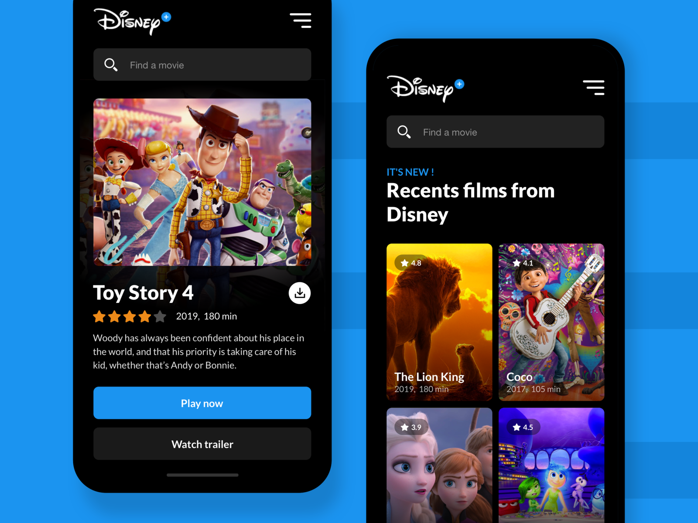
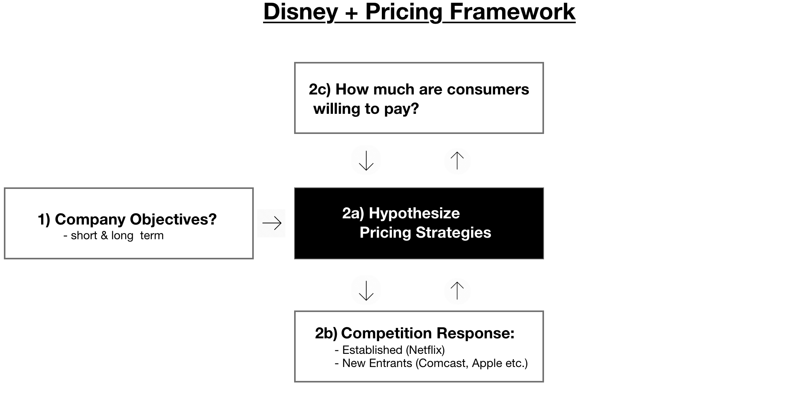
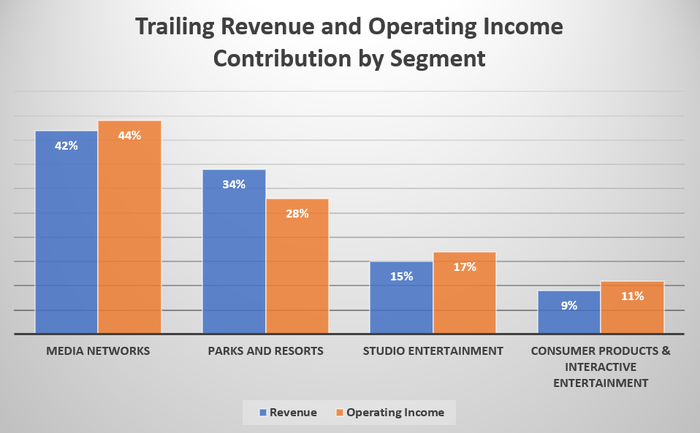
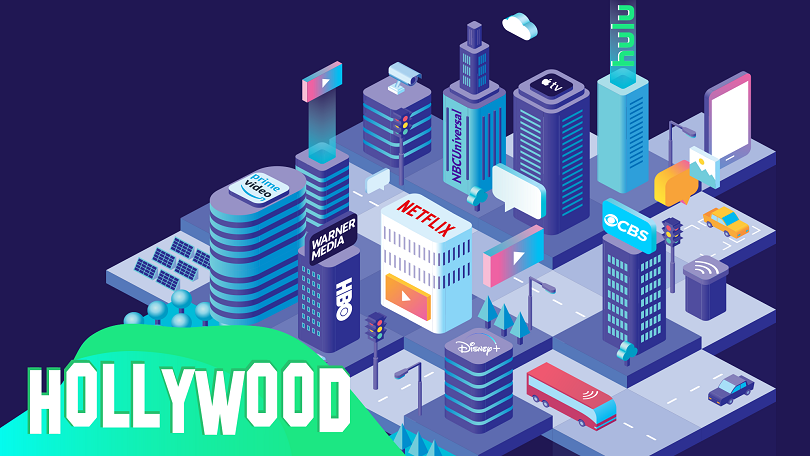
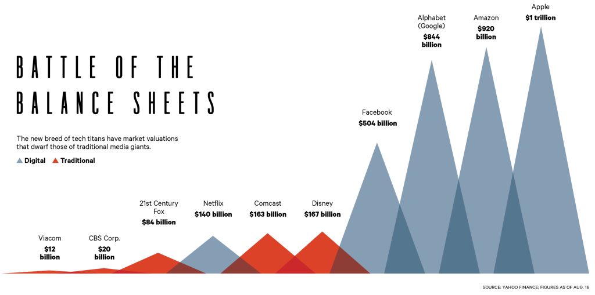
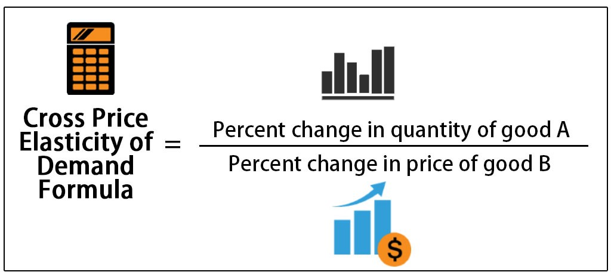
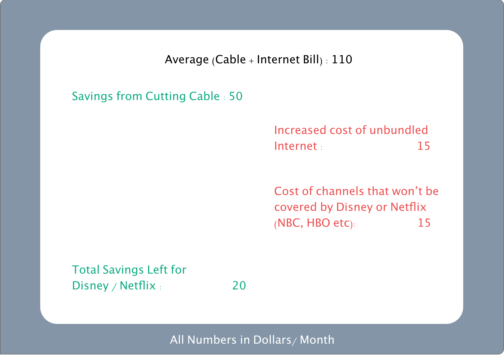
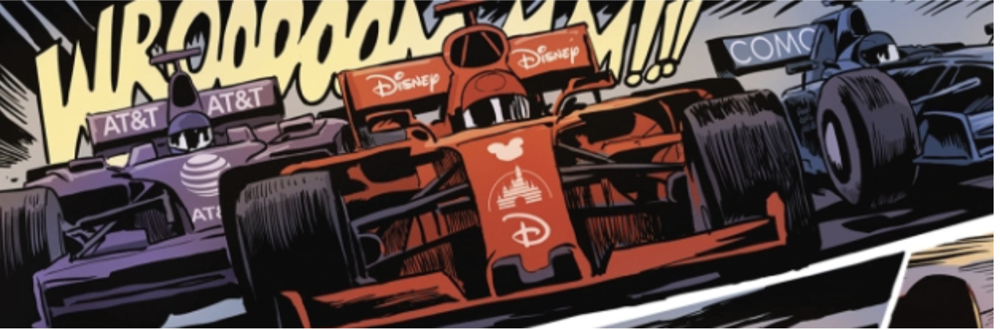

[//]: # (The following 2 lines are the excerpt)

### Preface

With its highly anticipated "Disney Plus" streaming service set to launch in November, Disney is rushing into the media streaming business, eager to capture what it sees as the future of entertainment.

Yet The House of Mouse is not alone in charging into this frontier. A slew of media titans are entering this space and Netflix already lays claim to much of the market. With so much competition, Disney's success will largely depend on the **pricing strategy it deploys for its new stream offerings.**

In this article we will answer the question : **How should Disney price Plus?**

I find a lot of times in such abstract business problems that have loads of available information, its hard to figure out whats important. I want you to focus on how we use our framework to acquire initial information about the industry and then synthesize that information into testable hypotheses. These hypothesis drive further inquiry and help us focus in on the most relevant information .

Let's get started!

  

*Source : Dribble*

If you're in a rush here's a quick summary

### 30 Second Summary

1. Disney's media network revenue is stagnating as people are increasingly leaving cable. Disney hopes to enter the streaming industry to offset these losses.

2. The problem is that the streaming industry is becoming increasingly saturated with other media titans. A classic price cut is unlikely to work because some of Disney's competitors (Amazon & Apple) can **vastly outspend them**, while others (Netflix) have proven to be **relatively price inelastic**.

3. Disney's best bet to avoid a price war with the other titans is to **work with Netflix to lower the price of a Netflix subscription.** This will free up dollars that consumers can then use to subscribe to Disney Plus. The key insight here is that Netflix and Disney are **likely complementary goods** because they have very different content. Only when combined would they form an effective replacement for cable. I will expand upon this idea later in the article.

Now, for the full article...

### Agenda

When people think about pricing they often think about costs. However, subscription based tech services usually have negligible variable costs anyways. What's more important I'd argue is understanding how a pricing strategy fits under the constraints of company objectives, competitor retaliations, and consumer budgets. As such, in this article we will :

1. Determine Disney's main objectives with launching Disney Plus and align our pricing strategy accordingly.
2. Understand the weapons that various competitors have and how we can develop a pricing play that minimizes the lethalness of their counters.
3. Determine how much consumers are willing to pay
4. Create pricing hypotheses from the above information

  

### Company objectives
First thing's first, why does Disney want to sell directly to consumer anyway? After all, it was making a cool **$300 million** just sitting back and letting Netflix act as a distributor of its content.

Cleary Disney believes that it can do better. Scratch that, Disney believes that it **must** do better. Why? Well a quick look at Disney’s revenue break down shows us that nearly **half** of total revenue and operating income come **from media networks and TV**. This is an industry that is taking increasingly heavy losses as more and more people cut cable in favor of streaming services. Indeed even if media networks revenue declines by 10% in the coming years, it will result in a **2.5 billion dollar revenue loss**. $300 million is a trite sacrifice to make if Disney Plus can be a viable replacement.

*Source : The Motley Fool*

Thus Disney realizes that it will need to effectively monetize streaming in order to replace declining network revenue. But in order to do that it must first gain and secure market share.Our pricing strategy will have to balance this short term demand for market share with a long term need for profitability.

Now that we know a little more about company goals, let's understand the competition a little better. Then we can dive into making pricing hypotheses.

### Competitor Overview

1. **Established Competitors** : The obvious incumbent here is Netflix. The $180 billion streaming titan enjoys the subscription of 70% of Americans. However, this titan does have a **potential Achilles heel: Licensed content**. Despite Netflix’s impressive lineup of original shows, licensed content still accounts for 80% of viewing time. And with major pullbacks from Disney and NBC, Netflix is expected to lose content worth 20% of its total viewing time. Netflix is not blind to this and is spending vast sums of money to create original content to fill the void.

  

  
  

2. **New Entrants**:A host of competitors from Time Warner to Comcast are expected to make entry in the next year. NBC (owned by Comcast) and CBS all have beloved shows of their own including the current number one on Netflix (Friends). Furthermore these competitors are prepared to spend vast sums on original content. And then there are Amazon and Apple. Though they currently lack as much original content as some of the other players, their colossal size will allow them to spend orders of magnitude more on content creation than any competitor (not to mention that the size of their balance sheets allows them to take on way more debt if necessary).  

>> ##### In a world of titans, Amazon and Apple are Olympians

*Source : Yahoo Finance*

This may seem like a grim landscape for Disney to accomplish its dual mandate of both large market share and long term profitability, but armed with this knowledge of competitors let us hypothesize some possible pricing strategies.

### Hypothesis 1: Fierce Price Undercuts

Let's think about what we know. **Netflix is in a vulnerable state.** It's losing much of its most popular content and in order to finance the production of replacement content it has to constantly increase prices. (Twice this year alone). Disney can market itself as a cheaper alternative and rapidly steal market share before Amazon and Apple have time to create and mobilize their own content armies. And because Netflix has to burn so much cash right now, it cannot drastically lower prices in response.

Given what we know, this hypothesis does sound promising. However in order to test it, we need to validate two major assumptions that it makes. Those assumptions are :

1. **There is a high cross price elasticity of demand between Netflix and Disney** : This is economics jargon for how much would the demand for Netflix fall given a certain price reduction in Disney. If the two are strong substitutes then a drastic reduction in price from Disney would allow them to capture a lot of market share from Netflix. But this is a major assumption that we need to validate.

*When I say high cross price elasticity, I mean high magnitude, technically speaking if Disney and Netflix were strong substitutes there would be a negative cross price elasticity*

2. **Disney will be able to raise prices in a prompt manner:** How long would Disney need to deploy these fierce undercuts to achieve its market share goals? How painful would the process of increasing prices be? Even if Netflix can’t match price cuts, could other new entrants? The last thing we want is Disney to be stuck in an unprofitable price war that it started.

### Testing Assumption 1 - Cross Price Elasticity:
Without historical Disney Plus pricing data, we don't have an exact way of measuring cross price elasticity with Netflix. However we can estimate it by asking several questions:

1. **Is Netflix really a substitute for Disney?** If I were a family thinking of leaving cable, I would want to replace it with both the violent and sexual hits of Netflix as well as the family friendly shows and sports of Disney/ESPN. This suggests that **Disney and Netflix might actually be complementary goods.** The cheaper one service gets, the more likely a family will cut cable and subscribe to both services. The average cable subscription comes **with over 200 channels**, plus live sports. Thus, you **can't fully replace cable with just one streaming service.**

2. **How Elastic are Netflix's Customers?** Despite increasing prices and shrinking content, Netflix has ***still*** managed to increase subscribers (see chart below), even as lower priced options like Hulu exist. This testifies to the relative demand inelasticity of Netflix's customers. Want an explanation? Remember Netflix has a staggering 70% market penetration, meaning they have **troves of data** and know exactly what viewers like and want to see. This is a powerful moat that keeps users locked in and prevents an easy invasion from other titans.

The evidence suggests that Netflix and Disney are complementary goods and that Netflix customers are fairly inelastic. Thus we can estimate that there is a low cross price elasticity. Assumption 1 fails

### Hypothesis 2: Commoditize the Complement

Our first hypothesis failed because we recognized that Netflix and Disney might actually be complementary goods that together are substitutes for cable. We further learned that Netflix is a very sticky platform due to their vast data stores. As such, Disney must realize it probably won't be able to steal vast market share from Netflix. **Thus Disney should aim to make Netflix as cheap as possible.** This will free up consumer dollars so that when they cut cable they have room to buy Netflix as well as Disney. The major assumptions here are that

1. Disney can drive down the price of Netflix enough to warrant cutting cable while still being able to capture extra consumer surplus.
2. Consumers will buy Disney with their saved Netflix dollars and not go to some other competitor
3. We also need to figure out how much consumers would be willing to pay for Plus, observe how we calculate that information as we test assumption 1 below.

### Testing Assumption 1 - Ability to Drive Down Netflix Price

We need to figure out how much a consumer cutting cable is willing to pay for both Netflix and Disney. This is critical for any pricing strategy.

**My assumption is around $20.** See the picture below for how I arrived at this number.

Netflix takes 13 of those $20 so only 7 are left for Disney. This is not a terribly low price and is in fact consistent with Disney's current proposed price for plus. However it gives little room to increase prices in the future if need be. How then can Disney encourage Netflix to lower its prices so that it can capture a larger share of the surplus?

- **Cut a Deal with Netflix** : Disney should make a deal with Netflix that makes Netflix subscription cheaper for those who have Disney Plus and visa versa. Now, Disney gets to instantly access Netflix's massive customer base, with much less marketing costs. In addition, Netflix no longer has the same urgency to replace Disney content because Disney Plus is cheaper for their subscribers. This would shrink Netflix's content creation costs and allow them to pass savings directly on to the consumer, further decreasing their prices. The added benefit is that if this deal is exclusive, new cord cutters would have little incentive to try out more expensive competitors. Why would I choose NBC if Netflix and Disney bundled together give me everything I need at a discount. **This would validate assumption 2** . (Assumption two was making sure that users would spend their savings from Netflix on Disney and not another competitor)

- **Exert Pressure with Hulu**: Hulu is the closest thing Disney has to a Netflix substitute. It could engage in mild price cuts to put a little pressure on Netflix into lowering its prices and cutting a similar deal as mentioned above.

### Quick Projections

Doing some quick numbers. Let's say that Disney is unable to lower the price of Netflix and can only charge 7$ a month for Plus. At this rate, Disney believes that it can bring in 130 million subscribers by 2024 = about 11 billion in annual revenue. This is by itself very promising as Disney could cover even a 50% decline in media networks revenue with this (Note that such a decline is very unlikely).

If Disney could lower the price of Netflix and charge more itself, then it could drive even further profitability. Icing on the cake.

### Risks
There is reasonable evidence to suggest the assumptions for hypothesis two are at least partially valid, and certainly the numbers are promising. However, a very reasonable critique of this "Commoditizing the Complement Plan " is that making Netflix and Disney as a package together so attractive would only further incentives people to cut cable, which cannibalizes Disney's single largest revenue stream: Media Networks. My response is that **cable revenue is deteriorating due to market trends outside of Disney's power.** It is in the company's best interest to make sure that it captures those freed up cable dollars by tagging along with Netflix rather than seeing them go to another competitor.

### Conclusion
The theme of this article was minimize your research.

We were confronted with an abstract problem : How should Disney Price Plus? It would have been easy to get lost in mountains of industry research, but we were able to use our framework to quickly understand Disney's motives and its competitor's strengths and weaknesses.

From this framework we made several pricing hypotheses. It could have become easy again to get lost in research in order to validate these hypothesis. Instead we boiled down each hypothesis to several key assumptions that told us exactly what further information we needed.

*Source: Variety Magazine*

In the end we learned that instead of Disney trying to lower their own prices, it might make most sense for them to try and lower Netflix's prices.

It's going to be an interesting next couple of months as we see a whole host of media titans vie for dominance on this fascinating frontier of entertainment.

Till next time!

### References

https://variety.com/2018/digital/features/media-streaming-services-netflix-disney-comcast-att-1202910463/

https://www.nytimes.com/interactive/2018/11/16/business/media/disney-invests-billions-in-theme-parks.html

https://www.forbes.com/sites/greatspeculations/2019/03/08/loss-of-licensed-content-is-an-underrated-crisis-for-netflix/#20b62a302111

https://www.pcmag.com/news/367423/the-new-entertainment-giants-welcome-to-the-streaming-indus

https://www.bcg.com/en-us/industries/technology-industries/pricing-tech-industry.aspx
