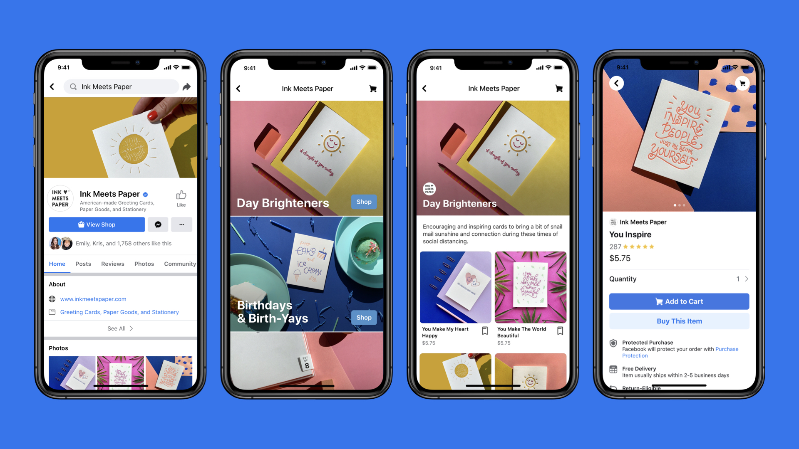
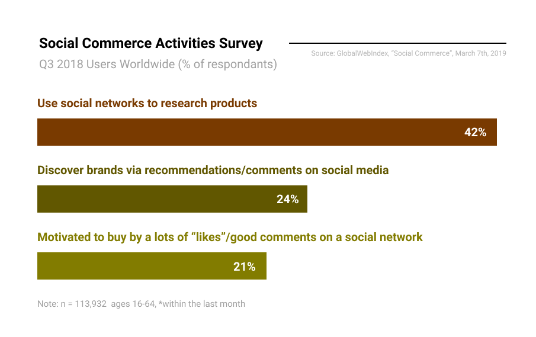
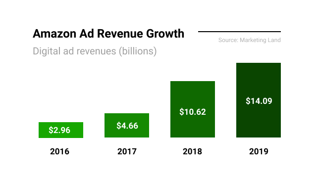
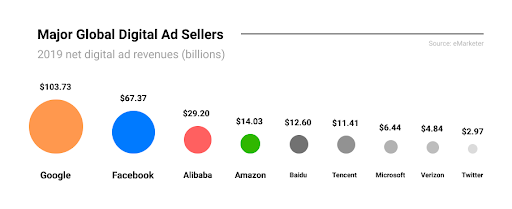
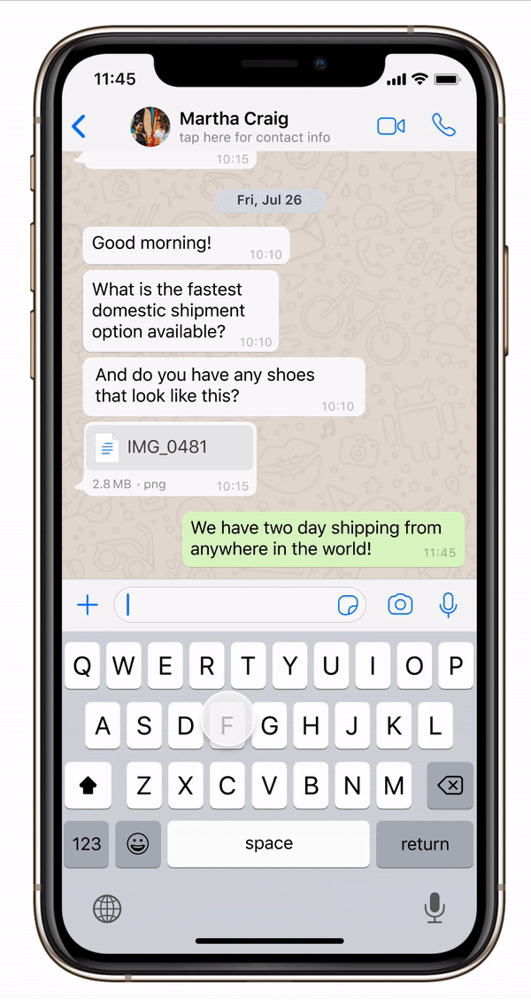
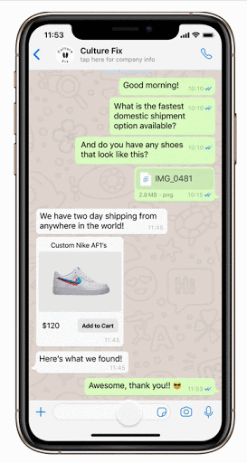
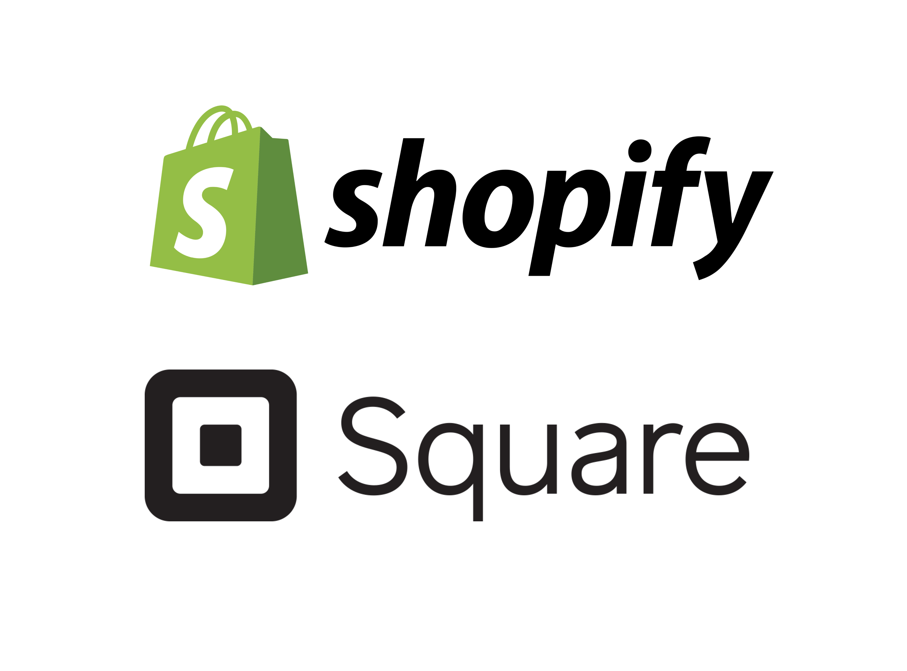
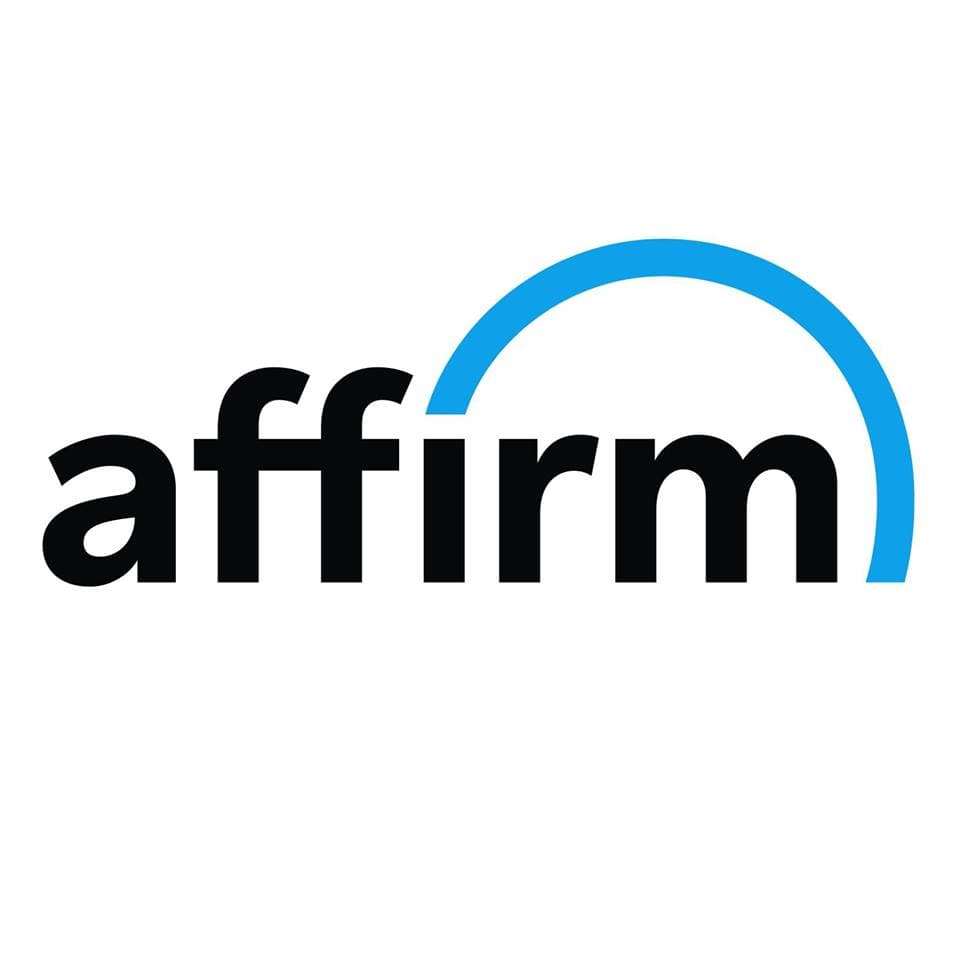

### Preface:   

Facebook has been in the news quite a bit recently over free speech regulation controversies, employee walkouts, and potential antitrust challenges to both the Giphy acquisition ($400 million for GIFs!?) and the $5.7 billion Jio Platforms investment. Amidst all the activity, last month, the social media giant also announced the launch of “Facebook Shops”, in another step towards a full suite of small business sales enablement products for Facebook. While the move hasn’t received as much media fanfare, this release is pretty big news and investors certainly think so too, as $FB stock rose 8% in the three days following the official announcement. But what exactly is Shops and what does it mean for Facebook? We look to answer those questions as we take a deep dive into Facebook Shops.

### Agenda

1. What is Facebook Shops?
2. How this Affects SMBs
3. How this Affects Facebook
4. Potential Next Steps

### 30 Second Summary

1. Facebook Shops creates a unique fully native social shopping experience for users that should give SMBs (small-medium sized businesses) better ad attribution and increased sales conversions.
2. Facebook Shops gives Facebook access to valuable first-party shopper data which should strengthen their advertising business and help them build upon their “Walled Garden of proprietary data”
3. It opens up future opportunities for a potential Whatsapp integration and stronger shopping recommendations.
4. Shops may even lay the foundation for a further push into the financial services industry through small SMB loans and point-of-sale financing.

## What is Facebook Shops?

Facebook *loves* drawing inspiration from other companies. First, Stories from Snapchat. Now, online storefronts from Shopify. Here are the 5 main features of Facebook Shops:

Note: If you’re wondering why there aren’t a lot of storefronts on Facebook yet, it’s because they’re planning to roll out functionality and access to all business accounts over the coming months.

#### 1. The Storefront

- **Business Facing**: Business owners will be able to spin up a customized digital storefront that’s unified across Facebook and Instagram and native to the platform. Once business owners create their Shop, they can then add products one by one or import them all from their preexisting e-commerce site. In addition, they can create collections around the products to convey a theme or simply display a curated selection. All of this is simultaneously updated across Facebook and Instagram.

- **Customer Facing**: Users can access a business’s Shop directly on their Facebook and Instagram profiles (as seen in the images below) and buy products without ever being forced to go to another website. Later this year, Instagram will add a Shop tab in Instagram Explore to allow users to browse products from various companies.

#### 2. Facebook Checkout

- **Easy Pay**:  When placing an order, customers will have the ability to use Facebook Pay across all stores instead of inputting credit card information every time. This easy, one-click purchase system would be present for all Shops.

- **Transaction Fees**:  Facebook will charge businesses “5% per shipment, or a flat fee of $0.40 for shipments of $8.00 or less”. This fee includes taxes and the cost of payment processing.

#### 3. Streamlined Communication

-  Customers can seamlessly message the business over Messenger, Instagram DM’s, or Whatsapp to ask questions about products or shipping. Once an order is placed, customers will then receive order/shipping updates through Messenger or Instagram DM’s.

#### 4. New Selling Channel

- **Facebook and Instagram Live:** If a business is streaming over Facebook Live or Instagram Live, customers can now easily swipe up on mobile or click a link on desktop to purchase any products being showcased.

- **Loyalty Programs:** Businesses can create loyalty programs that offer dynamic incentives to customers through targeted advertisements or automated messages for higher engagement. For example, customers can rack up “points” as they shop or complete certain activities (following an account), which they will then be able to redeem for product discounts.

#### 5. Partnerships

- Finally, Facebook Shops isn’t operating in a vacuum. In fact, Facebook partnered with Shopify, BigCommerce, WooCommerce, and many other major players to provide easy integrations and allow entrepreneurs to access as many selling channels as possible.

## How this Affects Small/Medium Businesses
  

**1. The Need For E-Commerce:**  
The Covid-19 pandemic has further heightened the importance of having an online e-commerce presence. With nationwide stay-at-home orders, millions of Americans have turned to online shopping and, whether they like it or not, are developing new online buying habits. Facebook Shops thus gives SMBs who need an e-commerce solution a lightweight option to set up a virtual storefront and facilitate online transactions at no upfront cost on a platform that millions of people use and trust.

**2. Reducing Friction in the User Purchasing Journey:**  
As for the reported 90 million SMBs already on Facebook, being able to set up an additional storefront on a platform where they already do a majority of their online advertising, should help reduce friction in the user purchasing journey, which would ultimately lead to more sales. As eMarketer’s Andrew Lipsman puts it, Facebook is generally seen as an “upper-level funnel” where people discover products they might purchase in the future. **Adding purchasing capabilities would flatten that funnel, reducing the steps the user has to take to ultimately purchase that item they discovered on Facebook.** The auto-filling easy pay feature across all shops (which leverages Facebook’s unique network effect) should also help increase conversions as purchases can be made in a matter of seconds (rather than minutes).  And lastly, a reduced number of steps in the purchasing journey means fewer steps that need to be tracked, which should allow Facebook to provide clearer and simpler attribution models for SMBs.

## How this Affects Facebook
 

**1. Filling a Void in E-commerce with Social Commerce:**  
 When you know you want to buy something, Amazon is unequivocally the place you go to. But, as Jeremy Bowman from the Motley Fool says, Facebook provides something that Amazon can’t: discovery. As we touched on earlier, Facebook and Instagram are often sources of ideas for future purchases. A study done by GlobalWebIndex with over 100,000 internet US and UK internet users, found that 42% of consumers research products through social media. Whether it’s that nasty Paul George dunk with his new Nike PG4 shoes or your friend's comment about Shake Shack, brands are everywhere on Facebook and users are constantly interacting with them.

This makes Shops a natural next step for Facebook to further monetize their audience and create a unique social commerce experience that keeps users on Facebook. And with 2.4 billion daily active users across Facebook, Whatsapp, and Instagram – each spending around **38 minutes a day across the apps** – Shops represents a big opportunity. Amazon should continue to be the place to go if you know you want to buy something, but Facebook Shops could very well be the place for casual shoppers simply looking for inspiration.

**2. Strengthening Facebook’s Advertising Business:**  
While additional revenue from Shops’ transaction fees would diversify Facebook’s revenue stream, advertising is where Shops should bring the biggest benefits for Facebook. Facebook and Google have a duopoly on the digital ads market, but Amazon has seen the biggest growth going from practically **$2.96 billion in 2016 to over $14 billion** in ads revenue last year.

Amazon’s success has primarily been centered around the fact that it has an enormous amount of shopper data by virtue of being the top destination for product searches and purchases. Just as importantly though, since transactions occur in the same ecosystem as the ads being run, Amazon can accurately attribute ad impressions directly to actual purchases, giving ad buyers a clear picture of the effectiveness of their campaigns.With Shops, Facebook can emulate Amazon by generating their own shopper data to improve ad retargeting and provide clearer ad attribution. This should make Facebook ads more valuable and even a small increase in ad prices could translate to **billions** of dollars in additional revenue. Deutsche Bank's Lloyd Walmsley, for example, thinks Shops could drive as much as $30 billion in incremental revenue. And, as Mark Zuckerberg himself says, “we know that if Shops are valuable for businesses they’re going to in general want to bid more for ads”.  

**3. First-Party Data and Building a “Walled Garden”**  
There’s no question that the ad-tech space has been in the midst of a significant shift ever since Google’s announcement in January that it would be eliminating third party cookies. At a high level, third party cookies are pieces of data placed onto your browser by advertisers on a website where their ads are displayed, that allow advertisers to track your activity and send you targeted ads. So if you’re on the New York Times, for example, third party cookies are what allows digital advertisers to send you those creepy ads about the Adidas shoes you just looked at.

Regardless of whether Google’s intentions behind eliminating third party cookies were for the “greater good” of privacy or not, the move has put a higher emphasis on first-party data, which is data collected by the owner of the site you are visiting. First-party data typically consists of a user's identity, such as a name or email, as well as behaviors, such as browsing history or purchase patterns. Generally, first-party data is seen as  “less creepy” since it is voluntarily given and helps improve a user’s experience on that website  (i.e. storing passwords or auto-filling credit card payments).  

As such, those who stand to gain the most from the death of third party cookies, are those who generate the most first-party data. And those players are namely Facebook, Google, and Amazon due to the “Walled Garden” nature of their ecosystems. They have access to and control all the first-party data within each of their ecosystems (hence the “Wall”) which forces advertisers to use their marketing tools as opposed to other third-party digital advertising tools if they want access to the ecosystem.  

Shops in turn helps Facebook continue to build their “Walled Garden”. It keeps users on Facebook, as opposed to a retailer's site, helping them generate more first-party data. **This in turn helps Facebook give users beneficial features like easy pay (auto-filled payments information across all Shops) and SMBs better attribution and ad retargeting**. So without third-party cookies, Facebook’s first-party data becomes even more valuable, raising the relative ROI of Facebook ads and thus, whether you like it or not, the dependency advertisers will likely have on “Walled Gardens” like Facebook, Google, and Amazon in the future.

## Potential Next Steps
 

As mentioned in the beginning, Facebook Shops is most likely the first step towards a full suite of product offerings to assist/enable SMBs. We have a couple of ideas for what could come next:

### 1. Buying Within Whatsapp
Messaging has more and more evolved into a platform ripe with features. Apple introduced apps and services specifically tailored for iMessage (Game Pigeon 😍) and Tencent created an entire suite of services around WeChat. Facebook is looking to do the same with WhatsApp and will probably integrate Shops functionality into the messaging platform. **Potential customers should be able to talk to businesses, add products to a cart from inline cards or full-page displays, pay with Facebook Pay, and receive updates on shipping, all within WhatsApp** (see videos below for our mockup of what that process could look like). As Tencent proved with WeChat, selling through messaging platforms is a validated channel and could be just as lucrative for Facebook, opening up another much needed complementary revenue stream through sales commissions.

Our mockup of how Whatsapp could seamlessly integrate Shops functionality into the app
(left: SMB Perspective | right: Customer Perspective)
<table style = "margin: auto">
  <tr>
    <td > </td>
    <td> </td>
  </tr>
</table>

###2. Shopping Recommendations
This is admittedly an obvious play, but the mass amount of transaction data could assist Facebook in building more accurate customer behavior profiles and offering better product recommendations. This could manifest in multiple ways:

- Instagram could better recommend products cards in the Explore section
- Facebook could automatically and intelligently place products in a user’s Feed as a form of advertising without the business owner needing to conduct their own extensive segmentation
- The Shops page could be personalized and appear differently for every visitor

All of these improvements would benefit conversions, as well as boost ROI on advertising spend.

### 3. Small SMB Loans
As businesses continue to sell on the Facebook Shops platform, they will require capital to fund purchase orders and growth initiatives. But SMBs generally have a hard time securing loans from traditional banks due to their short credit history and/or lack of large collateral. Additionally, they may just require **micro-injections** to finance small projects instead of large sums of cash.

Some companies that work with SMBs have already recognized this need. For example, Square Capital and Shopify Capital offer small business loans from $500 to $250,000. As businesses/debtors continue to transact over their platforms, the two companies automatically take a portion of their sales, which constantly pays down the principal and “service fee” (aka fixed interest). Providing loans to SMBs may seem like risky business, but Square and Shopify have data on their side. Since they handle their potential debtors’ transactions in the first place, they can extrapolate and analyze historical sales, customer funnels, attrition rates, and overall performance. **Essentially, Square and Shopify can create accurate risk analyses/profiles of loan applicants**, and then choose to provide loans to less risky SMBs at low fees.

  

Similarly, as more and more transactions occur within its ecosystem, Facebook could set up a similar system and focus on small SMB loans. Some of the valuable data points it can collect to accurately estimate risk, sales potential, and repayment probability are:

1. Advertising conversions and ROI from Instagram and Facebook ads
2. Social media marketing/inbound marketing campaign performance by measuring engagement, account growth velocity, and clickthrough rates (especially when paired with data from Pixel)
3. Product virality through analyzing consumers posts and tags
4. Sell through rate by tracking page visits, product selections, and sales

Of course, even with all this data, it’s far from a slam dunk opportunity for Facebook. Comparatively, Shopify and Square have a much better 360° view of their SMB’s performance, whereas Facebook is limited to sales data conducted on its platform. Additionally, banks have extensive data on industry-specific historical performance and are experts on financial data segmenting, something that Facebook has no experience in. We think it would make sense for Facebook to partner with a bank to effectively roll out this small SMB loan program, and successfully open up a lucrative, diversified revenue stream.

### 4. Point of Sale Financing
On the other hand, instead of financing SMBs, Facebook could finance consumers. If you’ve ever bought something from Warby Parker, Casper, Mirror, or Peloton, you’ve probably seen an option to pay in small monthly installments, instead of shelling out three grand for your stationary bike (that you absolutely must have) at once. That’s powered by Affirm, a point of purchase financing solution with a dual benefit. Businesses see an increase in conversions because it no longer forces consumers to make that huge up-front financial commitment. In turn, it also helps customers spread out the costs in a more manageable way. Affirm makes money by either charging businesses commissions for financing their customers at 0% APR or by charging the end customers interest on their monthly installments for the convenience.

Facebook could/should do the same once Shops grows to become mainstream. This not only would substantially assist SMBs with sales, but also provide another significant revenue stream to Facebook.

  

### Conclusion
It’ll be interesting to see how Facebook rolls out Shops in the coming months and if people actually adopt it. There’s value on the table for both SMBs and Facebook alike, and there’s a lot of ways Facebook can leverage Shops to keep building out a full suite of Social Commerce sales enablement tools in the future. At the same time, growing consolidation in the digital advertising space is worrying. And with continued scrutiny of Facebook misinformation, antitrust, and data privacy issues, it’ll be worth also following the potential societal ramifications of this “super-platform” Facebook keeps building towards.

### Sources
1. https://www.shopify.com/blog/facebook-shops
2. https://techcrunch.com/2020/05/19/facebook-shops/
3. https://www.forbes.com/sites/pamdanziger/2020/05/31/facebook-shops-opens-for-small-businesses-is-it-a-dream-come-true-or-too-good-to-be-true/#54ba452113be
4. https://stratechery.com/2020/platforms-in-an-aggregator-world/
5. https://about.fb.com/news/2020/05/introducing-facebook-shops/
