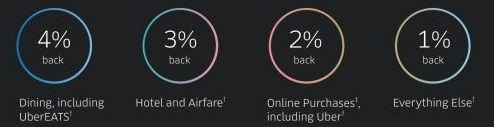
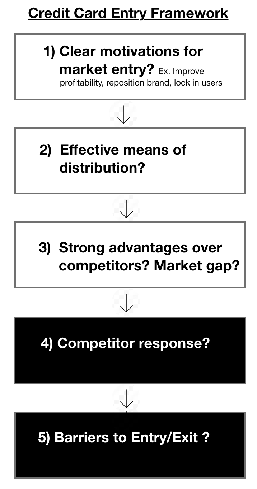
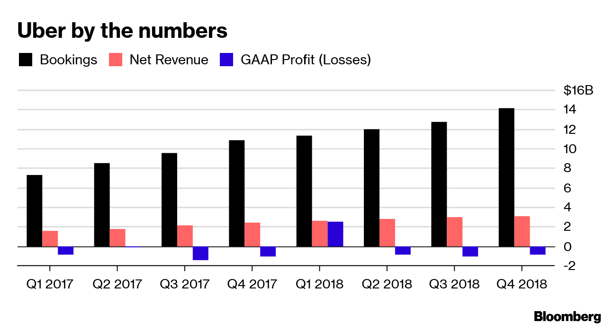
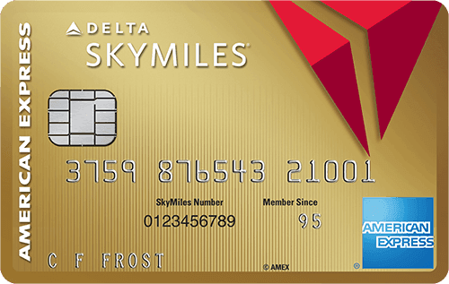
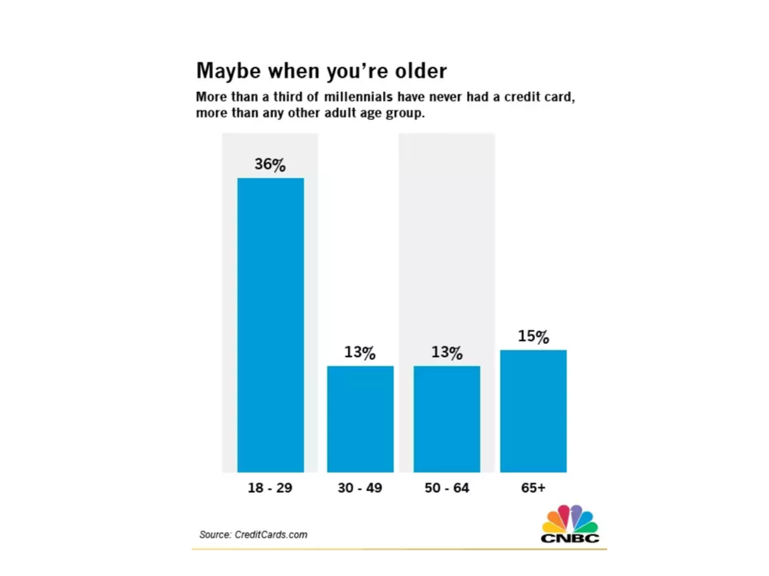
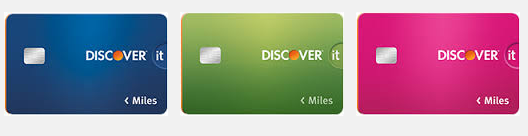
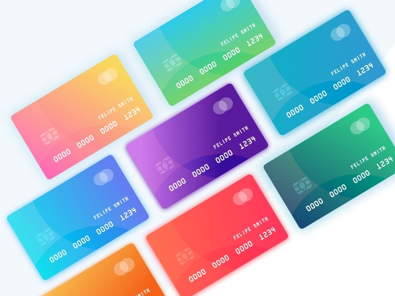

[//]: # (The following 2 lines are the excerpt)

### Preface
 

A lot is going on with Uber right now. Pre IPO preparations are fully underway as the company is busily expanding its rewards program and developing self driving vehicles. Amongst all of this activity, I'd like analyze an Uber product that I feel is often overlooked: **The Uber Credit Card**. I understand that this is not a brand new product. But in this article I hope to demonstrate why Uber entered this market and why it structured the card the way it did. Furthermore, I'd like to illustrate the thought process a business uses when it considers entering a new market.

A little about the Uber credit card. One can easily apply for the card within the Uber app. It has zero annual fees and gives the following cash back rewards:

The Uber Card is a partnership between **Uber, Visa, and Barclays**. Barclays is the bank that actually provides the money that backs the card, Visa is the network or "clearing house" that helps transfer the funds, and Uber is a distribution partner.
___________

### Agenda

  

      
  

  We will use the following framework to analyze Uber's market entry into credit cards.

First, we will determine why (if at all) market entry makes sense. We will do this by asking the 3 questions in white blocks on the right.

<b>If and only if</b> we find strong positives for each of these questions will we move on to the next piece of the analysis. This will delve into the risks of market entry (Questions in black blocks)

### 30 Second Summary

I would recommend reading as much of the article as you can as this is more about thought process, but if you're in a rush, here's a quick summary.

1) Uber's primary motivation for entering the credit card market is to generate low risk revenue streams that can offset the losses of its core ride sharing business.

2) Uber has a powerful means of distribution via its mobile app, and it has wisely positioned the card to be focused around millennials, a market segment that is underserved by current competitors.

3) Uber needs to understand that due to the race to the bottom nature of the credit card industry, growing market share through simple rate hikes is unlikely to work.

Without further ado, here is the full article...

### Motivations for Entry

Let's try to brainstorm some potential hypotheses of why Uber would want to enter the credit card market.

 **Hypothesis 1**: Generate customer loyalty: At first glance, it seems that Uber would want to launch this product to lock users into their service and lure them away from choosing rivals. Indeed this is a major reason that airlines issue such credit cards. But this idea simply ignores the facts. The Uber card offers 2% cash back on all online purchases. This means you would be getting the same rewards from an Uber ride as you would from a Lyft ride. So clearly Uber's goal here is not to generate loyalty through some exclusive benefits program. Indeed it has a separate rewards program for that very purpose.

 

    

**Hypothesis 2**: Improve Liquidity. Uber took on a [staggering loss of $1.8 billion last year](https://www.cnn.com/2019/02/15/tech/uber-2018-financial-report/index.html). So opening up new lines of business that can help the company regenerate its cash coffers makes sense. The question then becomes, approximately how much revenue could Uber hope to earn. To answer this, let's do some quick market sizing shall we?

* The transaction fee for each credit card purchase is about 2.4%. Once Visa, Barclays, and the acquirer(think of these as the guys who give the physical credit card reading hardware) get their cut, **Uber is left with say about .1% on every transaction**. (I'm not even going to include Uber's potential cut of the interest payments from overdue balances)

* Uber reaches about 75 million different users a year. [About 70% of these users pay with credit card](https://www.uber.com/en-UA/blog/cash-and-card-ua-en/). Let's assume the average Uber credit user spends $20,000 a year (This represents an estimated average of users from both developed and emerging markets). If Uber can convert even 10% of these users to the Uber credit card then it can make **$105 million a year**. What's really amazing is that Uber has pretty much **risked nothing**. Remember it is Barclays that is supplying the money to back the card.

If the idea of a side credit card business generating so much cash seems outlandish to you, consider that [Delta would have gone bankrupt several times if not for its lucrative credit card business](https://www.marketplace.org/2019/04/03/are-airlines-making-more-money-credit-cards-flying/).

   

Okay, so we have identified a clear reason why Uber might want to enter this market. However, even with clear motives for entry, there must be a scalable way for a business to distribute and advertise its product in order to be successful.

### Distribution
Traditional credit card companies and banks may have countless brick and mortar locations and spend fortunes on advertising to spread the word on their products. In fact customer acquisition costs in this industry is routinely around **$800 per new user**. Uber simply does not have the cash or real estate to match competitors on these traditional distribution channels.

What Uber does have is its app, and that might be the only channel it needs. As stated earlier, about 75% of Uber's 90 million monthly users pay with a credit card. This alone is an audience that is bigger than all but the three largest credit card issuers (Visa, Mastercard, and Chase). Because the signup process takes place directly in the app, Uber has a clear means of distribution that it can access without having to spend the same mammoth budgets on advertising as other credit card companies.

### Clear advantage over competitors?
Even with strong motives and distribution. A company's market entry can only succeed if it has significant advantages over competitors. These advantages can come from:

1. A product that is magnitudes better than current options in major performance indicators such as speed, price, etc. (If you go with this option Peter Thiel claims you must be at least 10x better)

2. A product that addresses a major market gap. Ex (An unmet consumer need or a segment of the market which is left out)

The overall Uber credit card is nothing standout so it must address a market gap to be successful. Our job is to find such a gap if it exists. We will do this by **segmenting the market**. Demographics, Geography, and Activities are all common segmentation techniques (amongst others). There doesn't seem to be any major Geographical forces at play so I will leave this one out. From an activities perspective, it is true that Uber rewards traveling generously so you could say Uber is trying to target frequent travelers. But the problem is that this segment of the market already has plenty of cards that meet its needs well (Uber offers no advantage to this segment).

A third way we can segment the market is by **Demographics**. If we break up the credit card market by generation we see some interesting statistics:

>> Less than a third of Millennials say they have a credit card, while more than half of people age 30-49 own one and nearly 70% of people over 65 do - Bankrate

  

    
  

We could go into the reasons of why Millennials are so hesitant on buying credit cards. But the bottom line is that there is clearly a lack of millennial centered credit cards on the market. **This is where Uber can make its entry.** It's no coincidence that although its overall rewards are pretty lackluster, the card really shines in rewards for eating out and purchasing online, **activities that Millennial dominate**. Perks that include credit on streaming services like Netflix and Spotify hint that Uber is clearly positioning itself to capture the unsaturated (and growing) Millennial market segment.

### Competitor Response?
So clearly there are reasonable business motives, defined distribution channels, and a robust target market. These are all positive signs for market entry. However, if competitors are overly aggressive in response to Uber's entry, potential benefits may be severely dampened.

To guess competitor responses it is often helpful to look at past cases of entry in the industry. There is however no historical precedent of a rideshare company issuing credit cards. Thus, I will be drawing parallels with **airline credit cards as well as the broader credit card industry**. While not perfect analogies I think there are some useful insights to be gained.

#### Lessons from Airline Credit Cards: Don't make the card too specific

American Airlines and United were the first airlines to start giving miles for spending on their credit cards. Business was lucrative because airlines could now sell miles in advance to credit card companies. In addition, reward miles helped increase customer loyalty towards a specific airline. Obviously though other airlines started doing the same thing in order to lock in customers, saturating the field. Then, some credit card companies (like Discover it) started creating cards that could be used with any airline, in some cases **diminishing the value of airline specific cards**

  

Uber has clearly learned from this history and acted in a brilliant way that disables an aggressive competitor response on this front. By giving the same rate back on any rideshare, Uber is preventing other credit companies from trying to win back market share by offering an "any rideshare company" credit card. In essence, **Uber saw how competitors might react... and did it first.**

#### Lessons from the Broader Industry: Don't race to the bottom

In 2003, the average US credit card reward rate was about 1.1%. Firms tried outdoing each other by offering more and more lavish rewards. In 2 short years the average reward rate had **increased by about 50%**. Uber needs to understand that because of these race to the bottom dynamics, it might have little choice but to raise its rewards if competitors do so. And likewise, it needs to understand that attempts to gain market share by simply raising rewards are unlikely to have a major effect because competitors will simply match them. In essence Uber is facing the classic **kinked demand curve problem of oligopolistic markets**

### Exit Strategy?

No matter how promising a market entry looks there must be a clear exit strategy. Markets can sour and losses can surpass estimates. If exiting is too costly, the risk of entry may not be justified.

I don't know the specifics of the Uber Barclays contract, but a smart one would have allowed Uber to sell its stake in the card to Barclays after x years. In this case a card exit would be relatively cheap as the only cost Uber might have to bear is replacing the actual plastic cards. All in all, this would be a solid plan that makes a less painful exit possible.

  

### Conclusion
I hope this showed you how we think about entering new markets. We systematically thought about what Uber needs to consider for a smart entry and in doing so we discovered why Uber structured the card the way it did. Next time you wonder why a product is marketed or designed a certain way, consider walking through this framework .

In summary, we saw that the card generates substantial low risk revenues, takes advantage of the market gap facing millennials, and offers its rewards in a way that mitigates aggressive competitor responses. It's a smart business move by Uber and I look forward to see if they can grow their position in this fascinating market.

### References

https://www.cnn.com/2019/02/15/tech/uber-2018-financial-report/index.html

https://www.marketplace.org/2019/04/03/are-airlines-making-more-money-credit-cards-flying/

https://www.uber.com/en-UA/blog/cash-and-card-ua-en/

https://www.bankrate.com/finance/consumer-index/money-pulse-0616.aspx
